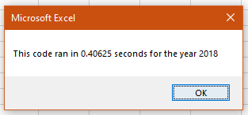

# Stocks Analysis
Performing analysis on 2017 and 2018 Stocks using recfractored code
---
### Project Overview 
This project looks at 12 different stocks, collected information from 2017 and 2018. For this project we are helping Steve and his parents to determine which stocks are worth investing in. In this challenge, we have taken our original code and refactored it to be more efficient. Now we’ll determine whether refactoring the code successfully made the VBA script run faster.

## Results 
We have completed analysis of all stocks from 2017 and 2018. We have taken pieces of our original code and updated it to run off an index and a more dynamic array.
By using the index and using the array method, we can reduce time because it allows the computer to access each data row only once. 
By defining the pre-sorted data, we are cutting down on the information the computer must run. It will no longer have to go check back through those rows to confirm that there are no other values in that range. 

We have used tickers to define the following attributes:
* Total volume
* Start price
* End price

Before applying the refractored code, the code was being run off an In loop. We can see that the times to execute the code for 2017 was 0.3789063 seconds and 2018 took 0.40625 seconds. 

After applying the refractured code, the code is now being run off the index and array method. We can see that this code took less time to run for both 2017 at 0.1210938 seconds and 2018 at 0.09375 seconds. 

Refactoring has proved to be generally beneficial and quicker in running the script. 

## Summary
**What are the advantages or disadvantages of refactoring code?**

Advantages:
* Code is more efficient - In this case, it made our code much faster to run
* Use less Memory
* Improves the coding logic so that a person in the future can easily read it.
 
 Disadvantages:
* Bugs can be introduced as the application and code become larger
* While it can make the code run faster it can take a lot of time to get any bugs out. Refractoring may reduce run time but doesn't always lessen overall time or resources spent on a project 
* Can be at a disadvantage if the future developers do not understand the original code. Therefore it is so important to leave good coding notes. 
 
**How do these pros and cons apply to refactoring the original VBA script?**
For this project we saw all these advantages and disadvantages. Refactoring the code left us with a more readable script and quicker run times. However, refactoring and priorities may change in future projects depending on the available time and resources. Broken code can be very time consuming. Refactoring may be more beneficial for larger projects. 

